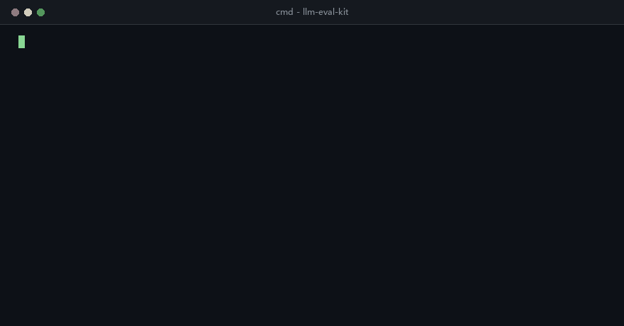
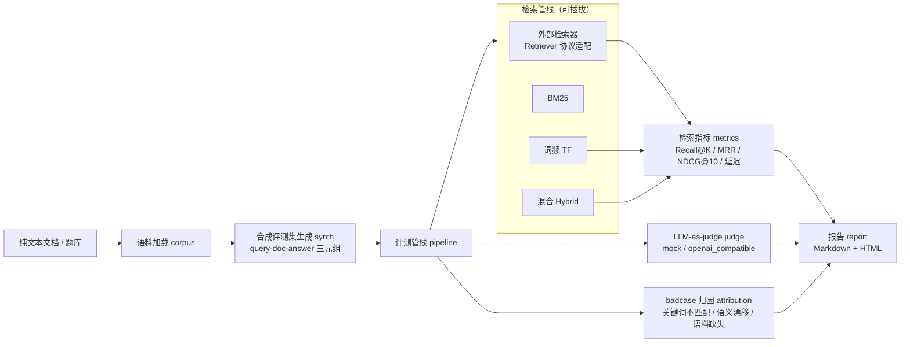

# llm-eval-kit




🌐 在线评测报告：https://lii-lii321.github.io/llm-eval-kit/ （push 到 main 后由 Pages workflow 自动重新生成发布）

离线可跑的 RAG 检索与 LLM 应用评测工具库：从纯文本文档合成评测集，对比多路检索管线，
用 LLM-as-judge 给答案做四维评分，把未命中查询归因成三类原因，最后产出 Markdown + HTML 双报告。
核心零第三方依赖，全部功能离线可复现，适合作为 RAG/LLM 系统的评测基座或教学参考。

## 功能特性

- **合成评测集生成**：从纯文本文档/题库构造 query-doc-answer 三元组。规则式生成器（词频 × 逆文档频率选关键词 + 查询模板），不依赖真实 LLM，固定 seed 完全可复现；支持同义改写构造词面不匹配的困难样本
- **评测数据集管理（JSONL）**：人工标注查询集的加载/校验/评测通道——`load_dataset` 严格校验（缺字段、重复 query_id、空相关文档等报错均带行号），`_meta` 元信息行记录标注日期/标注人/版本，`DatasetStats` 输出条数与查询长度分布；CLI `--dataset` 从文件读查询批量评测，与 `--fail-under` 门禁组合可用，见 [docs/datasets.md](docs/datasets.md)
- **检索指标**：Recall@K、MRR、MAP@10、NDCG@10（二元相关度）、命中率与 P50/P95 延迟，聚合指标附 bootstrap 95% 置信区间（固定 seed 完全可复现），支持多路检索管线同台对比
- **外部检索器接入**：Retriever 协议（duck typing）+ `CallableRetriever` 宽容归一化——任何检索系统（向量库 / Elasticsearch / 自研 RAG）实现一个 `retrieve(query, top_k)` 方法即可同台评测，协议不满足时报可诊断错误，见 [docs/ADAPTERS.md](docs/ADAPTERS.md)
- **评测回归门禁**：`--fail-under 指标名=阈值`（可多次），任一指标低于阈值进程退出码 1 并输出实测值 vs 阈值 vs 差距，可直接作 CI 合并卡点
- **LLM-as-judge 四维评分**：正确性 / 相关性 / 可操作性 / 清晰度（1-5 分）。provider 可插拔——内置确定性 `MockJudge`（离线可跑、测试用）；`OpenAICompatibleJudge` 读环境变量，未配置 key 时优雅跳过
- **badcase 归因**：对 top-K 未命中查询分类——关键词不匹配 / 语义漂移 / 语料缺失，附可解释 detail
- **报告输出**：Markdown + HTML 各一份，含指标表格、归因表、评分表与未命中示例
- **端到端 demo**：内置 24 段玩具语料 + 玩具 BM25/词频/混合检索器，一条命令跑通全链路

## 架构



## 快速开始

```bash
pip install -e .[dev]

# 一条命令跑通端到端 demo（合成评测集 → 三管线对比 → mock 评分 → 归因 → 报告）
python -m llm_eval_kit.cli demo --out reports
# 安装后也可用：llm-eval-kit demo --out reports
```

作为库使用：

```python
from pathlib import Path

from llm_eval_kit import (
    BM25Retriever, HybridRetriever, MockJudge,
    generate_eval_set, load_corpus_from_dir, run_evaluation, write_reports,
)

docs = load_corpus_from_dir("path/to/txt_docs")          # 任意 .txt/.md 目录
cases = generate_eval_set(docs, num_cases=50, seed=42)   # 规则合成评测集

data = run_evaluation(
    cases,
    {"bm25": BM25Retriever(docs), "hybrid": HybridRetriever(docs, alpha=0.6)},
    top_k=10,
    judge=MockJudge(),                                    # 未配置真实 LLM key 时的离线裁判
)
md_path, html_path = write_reports(data, Path("reports"))
```

真实 demo 实测数字见下方[「demo 实测指标」](#demo-实测指标)与 [docs/PERFORMANCE.md](docs/PERFORMANCE.md)。

### 用人工标注的评测集跑评测

除了规则合成，评测查询也可以来自 JSONL 数据集文件（格式规范与人工标注指南见
[docs/datasets.md](docs/datasets.md)，种子示例 [`examples/dataset_demo.jsonl`](examples/dataset_demo.jsonl)
为合成 demo 数据）：

```bash
python -m llm_eval_kit.cli --dataset examples/dataset_demo.jsonl --out reports \
  --fail-under recall_at_5=0.5
```

```python
from llm_eval_kit import load_dataset

dataset = load_dataset("my_annotations.jsonl")   # 严格校验，错误带行号
print(dataset.stats().describe())                # 条数 / 平均相关文档数 / 查询长度分布
cases = dataset.to_eval_cases()                  # 直接喂给 run_evaluation
```

### 接入外部检索器

任何能"给定查询返回 top-K 文档 ID"的检索系统（向量库、Elasticsearch、自研 RAG 管线）
都可以包成 `Retriever` 参与同一套评测，最短路径约 10 行：

```python
from llm_eval_kit import CallableRetriever, run_evaluation

def my_search(query: str, k: int):
    return my_engine.search(query, size=k)   # 返回 (doc_id, score) 元组即可

report = run_evaluation(cases, {"my-engine": CallableRetriever(my_search, name="my-engine")})
```

协议定义、结果归一化规则、`ensure_retriever` 自检与 Math_Tutor_RAG
`QuestionVectorStore` 的完整适配示例见 [docs/ADAPTERS.md](docs/ADAPTERS.md)。

## 评测回归门禁

`--fail-under 指标名=阈值`（可多次传入）给评测加硬性底线：任一指标低于阈值，
进程以退出码 1 结束，并输出实测值、阈值与差距。门禁作用于主管线（第一个检索管线）：

```bash
python -m llm_eval_kit.cli demo --out reports \
  --fail-under recall_at_5=0.85 \
  --fail-under mrr=0.8
# 通过时：评测回归门禁通过（主管线：bm25）：recall_at_5=0.9583≥0.8500, mrr=0.9375≥0.8000
# 不达标时（stderr）：门禁未达标：recall_at_1 实测 0.7500 < 阈值 0.9000（差 0.1500），退出码 1
```

支持的指标名：`recall_at_<K>`（随评测 ks，默认 1/3/5/10）、`mrr`、`map` / `map_at_10`、
`ndcg` / `ndcg_at_10`、`hit_rate`。

GitHub Actions 示例：指标回退时 PR 直接变红，评测报告作为 artifact 留档：

```yaml
name: Eval Gate

on:
  pull_request:

jobs:
  eval-gate:
    runs-on: ubuntu-latest
    steps:
      - uses: actions/checkout@v4
      - uses: actions/setup-python@v5
        with:
          python-version: "3.12"
          cache: pip
      - name: 安装依赖
        run: pip install -e .
      - name: 跑 demo 评测并执行回归门禁
        run: |
          python -m llm_eval_kit.cli demo --out reports \
            --fail-under recall_at_5=0.85 \
            --fail-under mrr=0.8
      - name: 上传评测报告
        if: always()
        uses: actions/upload-artifact@v4
        with:
          name: eval-report
          path: reports/
```

线上报告页（https://lii-lii321.github.io/llm-eval-kit/）由 Pages workflow 在每次
push 到 main 时重新生成，生成步骤同样带 `--fail-under`：指标不达标则中止发布。

## LLM-as-judge provider 配置

`OpenAICompatibleJudge` 全部通过环境变量配置（见 `.env.example`，均为占位符）：

| 环境变量 | 说明 | 默认值 |
|---|---|---|
| `EVAL_LLM_API_KEY` | API key；未设置时评分优雅跳过 | （空，跳过） |
| `EVAL_LLM_BASE_URL` | OpenAI 兼容服务地址 | `https://api.openai.com/v1` |
| `EVAL_LLM_MODEL` | 模型名 | `gpt-4o-mini` |
| `EVAL_LLM_TIMEOUT` | 请求超时秒数 | `30` |
| `EVAL_LLM_ALLOW_LOCAL` | 置 `1` 放行 localhost/内网地址（自建 Ollama 等服务用） | `0` |

安全默认：仅允许 http/https，默认拒绝 localhost、回环、私有与保留地址，凭据只从环境变量读取。

## demo 实测指标

以下数字由 `python -m llm_eval_kit.cli demo`（seed=42）真实跑出，完整解读见 [docs/PERFORMANCE.md](docs/PERFORMANCE.md)。
方括号内为 bootstrap 95% 置信区间（百分位法，重采样 1000 次）：

| 管线 | Recall@1 | Recall@10 | MRR | MAP@10 | NDCG@10 | P50(ms) |
|---|---|---|---|---|---|---|
| bm25 | 0.9167 [0.7917, 1.0000] | 0.9583 [0.8750, 1.0000] | 0.9375 [0.8333, 1.0000] | 0.9375 [0.8333, 1.0000] | 0.9430 [0.8442, 1.0000] | 0.06 |
| tf | 0.9167 [0.7917, 1.0000] | 0.9583 [0.8750, 1.0000] | 0.9375 [0.8333, 1.0000] | 0.9375 [0.8333, 1.0000] | 0.9430 [0.8442, 1.0000] | 0.08 |
| hybrid | 0.9167 [0.7917, 1.0000] | 0.9583 [0.8750, 1.0000] | 0.9375 [0.8333, 1.0000] | 0.9375 [0.8333, 1.0000] | 0.9430 [0.8442, 1.0000] | 0.16 |

MAP@10 与 MRR 数值相同是 demo 语料特性所致：每条查询只有 1 篇相关文档，此时 AP 退化为倒数排名。

badcase 归因：关键词不匹配 1 条（改写样本「什么是梦话？」——原主题词「幻觉」被换成零词面重叠的表达，纯词面检索的教科书式失败）；MockJudge 四维均分：正确性 4.83 / 相关性 5.00 / 可操作性 1.30 / 清晰度 4.43。

## 项目结构

```
src/llm_eval_kit/
├── tokenize.py      # 中英混合分词（ASCII 词元 + CJK 字符二元组）
├── corpus.py        # Doc 数据结构、纯文本文档加载与切块
├── dataset.py       # JSONL 评测集加载/校验/统计（人工标注集通道）
├── synth.py         # 规则式合成评测集生成器
├── retrieval.py     # BM25 / 词频 / 混合检索器
├── adapters.py      # Retriever 协议、CallableRetriever 与外部检索器适配
├── metrics.py       # Recall@K / MRR / MAP@10 / NDCG@10 / bootstrap 置信区间 / 延迟分位数
├── gates.py         # 评测回归门禁（--fail-under 的解析与判定）
├── judge.py         # LLM-as-judge（MockJudge + OpenAICompatibleJudge）
├── attribution.py   # badcase 三类归因
├── report.py        # Markdown + HTML 报告渲染
├── pipeline.py      # 端到端评测管线（多管线对比）
├── demo.py          # 玩具语料与 demo 编排
└── cli.py           # 命令行入口
examples/dataset_demo.jsonl  # 合成 demo 评测集（非人工标注）
tests/               # 290 个离线测试，零网络依赖
docs/PERFORMANCE.md  # demo 实测性能报告
docs/ADAPTERS.md     # 外部检索器接入指南（含 Math_Tutor_RAG 适配示例）
docs/datasets.md     # 评测数据集格式规范与人工标注指南
```

## 已知限制

- **合成查询偏词面化**：规则生成器基于词面统计，无语义理解；长中文串按虚词切分 + 截断到 6 字，可能产出「常见维度有正」这类不自然查询。评测查询不再只有合成一条路——人工标注查询集现已支持（`--dataset` / `load_dataset`，见 [docs/datasets.md](docs/datasets.md)），生产级合成建议用 LLM 合成或真实查询日志
- **中文分词是字符二元组近似**：不是真正的中文分词，跨词二元组（如「索评」）会引入噪声；对检索效果敏感的场景建议接 jieba 或真实向量检索
- **检索器是单机玩具实现**：BM25/TF 为纯 Python 教学实现，适合几百块以内的语料，未做性能优化；得分为 0（零词面重叠）的文档不返回结果
- **外部检索器的 badcase 归因依赖 doc_texts**：外部检索器不提供 doc_id → 原文映射时，归因会把所有未命中归为"语料缺失"，与真实失败机理可能不符（机制与建议见 [docs/ADAPTERS.md](docs/ADAPTERS.md)）；显式传入 `doc_texts` 可获得正确归因
- **NDCG 使用二元相关度**：不支持分级相关度标注（graded relevance）。JSONL 评测集的 `grades` 字段（0/1/2）目前只做格式校验并透传进 `EvalCase.meta`，指标计算仍按二元相关度（见 [docs/datasets.md](docs/datasets.md) 当前限制）
- **JSONL 评测集通道暂无参考答案字段**：`--dataset` 跑的评测中 LLM-as-judge 段会静默跳过（judge 需要参考答案）；CLI `--dataset` 的语料亦为内置玩具语料，外部语料 + 人工标注集的组合请走库接口（`load_corpus_from_dir` + `load_dataset` + `run_evaluation`）
- **bootstrap 置信区间在极小评测集上不可靠**：非参数百分位 bootstrap 在样本数很小（如 n<10）时覆盖率不足、区间偏窄，n=1 时退化为点估计；demo 规模（24 条）下的区间仅作不确定性参考，不构成统计学推断
- **OpenAICompatibleJudge 的真实服务验证范围**：已于 2026-10-02 对阿里云 DashScope（qwen-turbo，OpenAI 兼容模式）完成真实端到端调用，四维评分与 rationale 解析正确（见 [docs/PERFORMANCE.md](docs/PERFORMANCE.md)）；HTTP 层另有本地真实 socket 集成测试（`tests/test_judge_real_http.py`）。OpenAI 官方端点与其他 provider 未实测；仓库测试套件保持全离线，真实冒烟测试默认跳过（设 `EVAL_REAL_LLM_SMOKE=1` 与端点环境变量后可复验）
- **SSRF 防护只覆盖 URL 字面量**：域名解析后的 IP 不做二次校验（DNS rebinding 不在防护范围）
- **MockJudge 是词面启发式**：分数分布不代表真实模型裁判，仅用于离线联调与回归
- **demo 数字仅代表玩具规模**：24 段语料、24 条查询，不构成对真实业务语料的性能结论

## License

[MIT](LICENSE)
